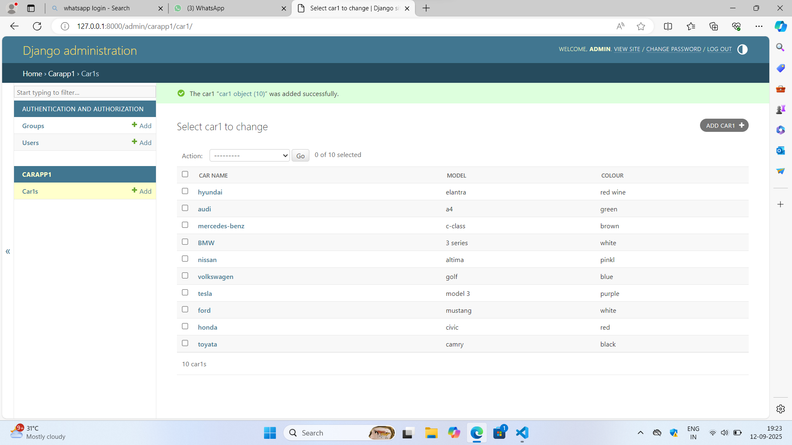

# Ex02 Django ORM Web Application
## Date: 16-09-2025

## AIM
To develop a Django application to store and retrieve data from a Car Inventory Database using Object Relational Mapping(ORM).

## DESIGN STEPS

### STEP 1:
Clone the problem from GitHub

### STEP 2:
Create a new app in Django project

### STEP 3:
Enter the code for admin.py and models.py

### STEP 4:
Execute Django admin and create details for 5 Car 

## PROGRAM

```
models.py
from django.db import models
from django.contrib import admin
class car1(models.Model):
    Car_name = models.CharField(max_length=255, help_text="Car name")
    Model = models.CharField(max_length=255, help_text="Model")
    Colour = models.CharField(max_length=255, help_text="Colour")
    
class car1Admin(admin.ModelAdmin):
    list_display = ('Car_name', 'Model', 'Colour')
admin.py
from django.contrib import admin
from.models import car1,car1Admin
admin.site.register(car1,car1Admin)
```


## OUTPUT



## RESULT
Thus the program for creating car inventory database database using ORM hass been executed successfully
